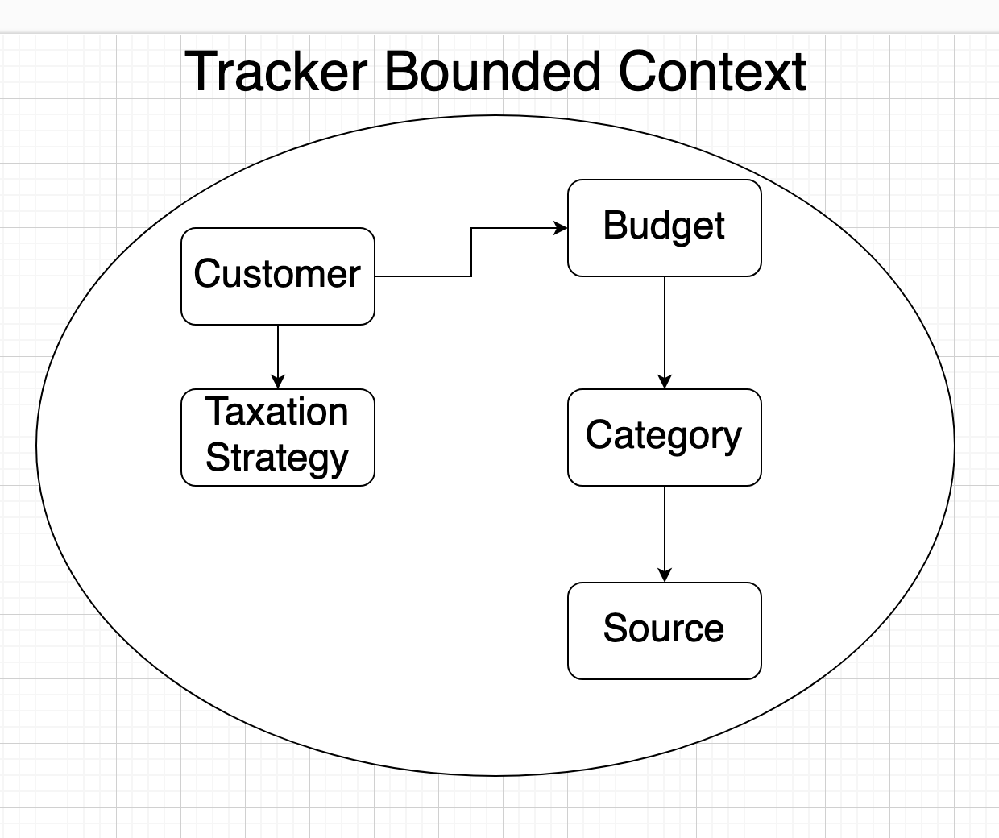

# Finance Tracker

What I am trying to build is a Finance Tracker application using some new techniques for me: 
* 3-rd party authentication (e.g [Auth0](https://auth0.com/docs))
* CQRS
* Domain Driven Design (Rich domain model)

## Features

* Auth0 authentication
* Create budget
* Create/Remove categories
* Add/remove income/outcome sources. Sources can be one-time / regular payments
* Pick a taxation strategy (e.g ФОП 3-тя група and so on)
* Calculate netto profit, possible filters by income sources / categories
* Saving goal. Customer can specify a saving goal (e.g save 10% of the netto profit this month), the application have to calculate the maximum amount of money he can spend each day (until the end of the business month) so that he fits in the saving plan. If customer spends more money than expected, we have to adjust the limit

## Architecure

The solution consists of multiple projects:

* <b>FinanceTracker.Api </b> - Handles client requests
* <b>FinanceTracker.Application</b> - Handles application logic, mainly unites the domain logic
* <b>FinanceTracker.Domain</b> - Handles core domain logic, the most important part of the application
* <b>FinanceTracker.Persistence</b> - Handles all of the database communications

## Domain

